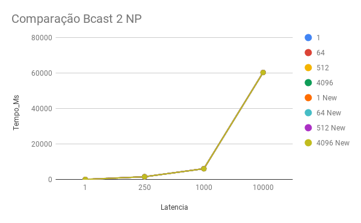
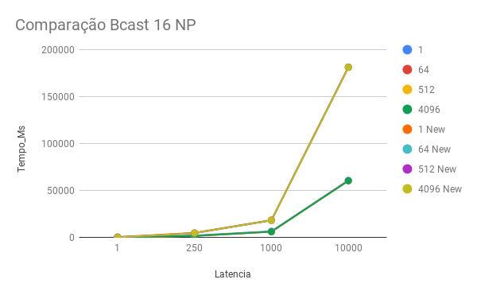
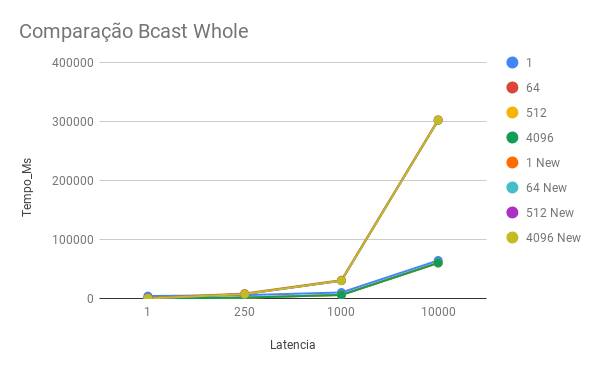
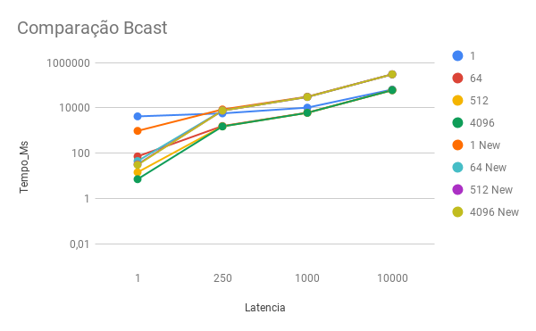
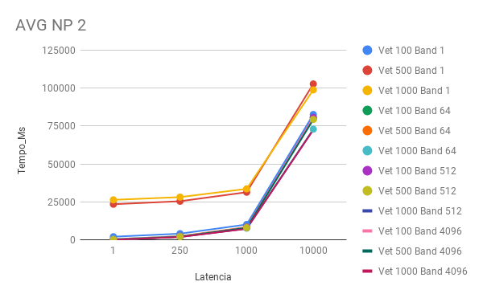
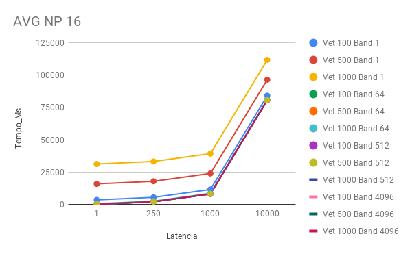
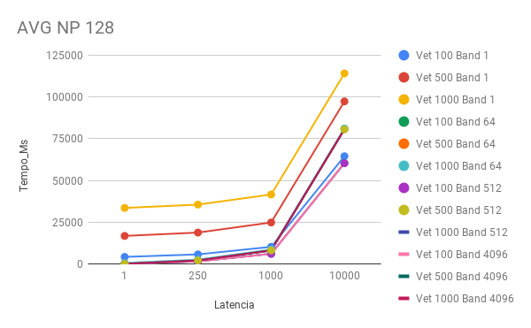

### Nome: Natan Luiz Paetzhold Berwaldt
### Disciplina: Programacao Paralela
### Matricula: 201710492

#  

## SPECS DA MAQUINA DE TESTES  
  
  Processador: AMD RYZEN 5 2600X   
  Nucles/Threads: 6 cores / 12 Threads   
  Frequencia: 3.6 - 4.25 GHz  
  Memoria: 16GB  
  OS: Lubuntu Linux Live  
  
    
      

# TRABALHO 7

### Parte 1:
  
  Codigo: [AQUI](new_bcast.c)

  Resultados:
  
  *Os resultados com a tag "NEW" são da implementação usando sr_bcast, enquanto os demais são utilizando a implementação Bcast padrão.*
  
  
  
    
      
        
    
  
  
    
      
        
    
  
  
    
      
        
   Como a visualização fica ruim devido a diferenca muito grande dos numeros, foi construido o seguinte grafico, utilizando a alternativa de visualização logarítmica do eixo y. Permitindo assim a visualização de que há diferenças entre as linhas do grafico.
    
  
  
    
      
        
  
  

### Parte 2:
  Resultados:

Cada linha dos graficos representa tanto um tamanho de vetor, como tambem uma largura de banda, reduzindo assim o numero de graficos.

  
  
  
    
      
        
  
    
  
  
    
      
        
  
    
  
  
    
      
        
  

